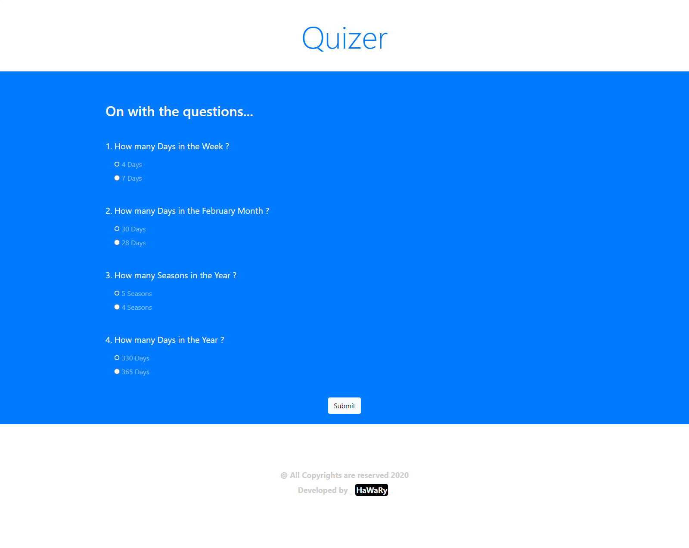

# Quizer

Quizer is a Quiz Application Template that you can use to expose your Questions Data in A smart Theme.
  

## Getting Started

You can try the APP from [here](https://mohamed-elhawary.github.io/quizer/)

## Prerequisites

Just Modern Browser like "Chrome" and a Code Editor for Deployment and Develop.

## Built With

* HTML5
* CSS3
* ES6 (Modern JS Syntax)  

## Framework

* Bootstrap

## Author

* Mohamed Elhawary  

## Contact Me  

* Email: mohamed.k.elhawary@gmail.com

## Deploy with Me

Feel Free to Deploy it with me, send Issues or a Pull Request and i'll deal with you, just test it First.

## License

Licensed under the [MIT License](LICENSE)

